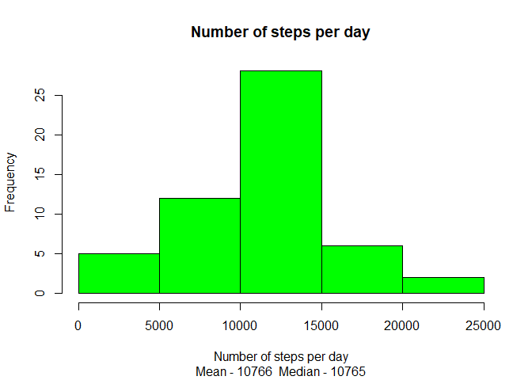
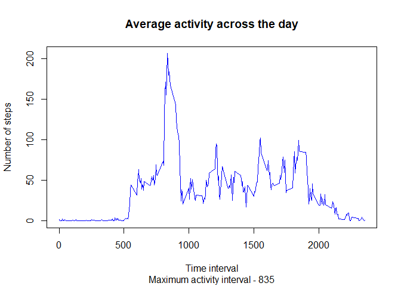
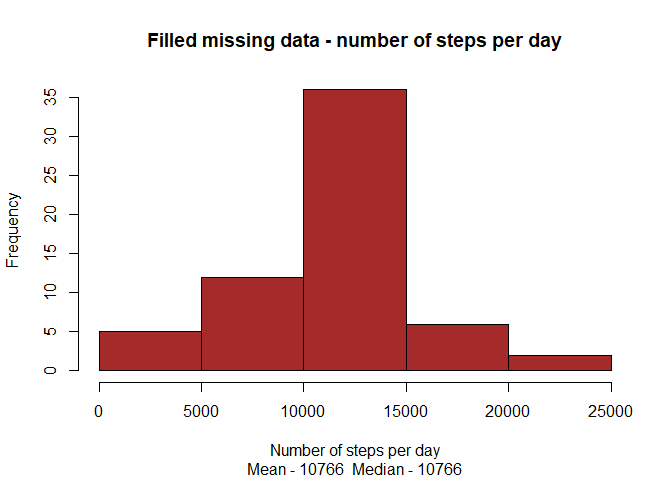
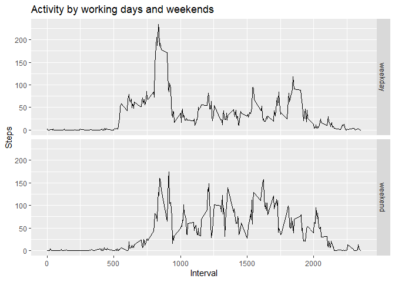

## Loading and pre-processing the data

Activity data has been downloaded from [Activity monitoring data](https://d396qusza40orc.cloudfront.net/repdata%2Fdata%2Factivity.zip) on January 6 2024.

Zip file ("activity.zip") has been downloaded and extracted ("activity.csv") without any data pre-processing or modification. File "activity.csv" was used for analysis presented below.

R command read.csv() was used to load data into R.

```r
        df <- read.csv("activity.csv")
```


## What is mean total number of steps taken per day?


```r
        total_step_number <- aggregate(steps ~ date, df, sum)
        s_mean <- as.integer(mean(total_step_number$steps))
        s_median <- as.integer(median(total_step_number$steps))
        cat("Number of steps per day:", 
            paste("Mean -",s_mean, " Median -", s_median))
```

```
## Number of steps per day: Mean - 10766  Median - 10765
```

```r
        hist(total_step_number$steps, col = "green", 
             xlab = "", main = "")
        title(xlab = "Number of steps per day", 
              main = "Number of steps per day",
              sub = paste("Mean -",s_mean, " Median -", s_median))
```

<!-- -->


## What is the average daily activity pattern?


```r
        average_activity <- aggregate(steps ~ interval, df, mean)
        max_int <- average_activity$interval[which.max(average_activity$steps)]
        cat(paste("Maximum activity interval -",max_int))
```

```
## Maximum activity interval - 835
```

```r
        plot(average_activity$interval, average_activity$steps,col = "blue", 
             type = "l", xlab = "", ylab = "", main = "")
        title(xlab = "Time interval", ylab = "Number of steps",
              main = "Average activity across the day",
              sub =paste("Maximum activity interval -",max_int))
```

<!-- -->


## Imputing missing values

Strategy to fill in the missing data on steps: replacement with average number of steps per 5 minute interval.

Numbers below demonstrate that this strategy has no material impact on average numbers.


```r
        NA_steps <- is.na(df$steps)
        cat("NA values: #",sum(NA_steps),",",as.integer(mean(NA_steps)*100),"%")
```

```
## NA values: # 2304 , 13 %
```

```r
        mean_df <- mean(df$steps, na.rm=TRUE)
        df_imput <- df
        df_imput[NA_steps,"steps"] <- mean_df
        total_step_number <- aggregate(steps ~ date, df_imput, sum)
        s_mean <- as.integer(mean(total_step_number$steps))
        s_median <- as.integer(median(total_step_number$steps))
        cat("Number of steps per day:", 
            paste("Mean -",s_mean, " Median -", s_median))
```

```
## Number of steps per day: Mean - 10766  Median - 10766
```

```r
        hist(total_step_number$steps, col = "brown", 
             xlab = "", main = "")
        title(xlab = "Number of steps per day", 
              main = "Filled missing data - number of steps per day",
              sub = paste("Mean -",s_mean, " Median -", s_median))
```

<!-- -->


## Are there differences in activity patterns between weekdays and weekends?


```r
        suppressPackageStartupMessages({
                library(dplyr)
                library(lubridate)
                library(ggplot2)
        })
        df <- mutate(df, day = wday(date))
        df <- mutate(df, day2 = "weekday")
        df[df$day %in% c(1,7),"day2"] <- "weekend"
        
        df_wd <- group_by(df, day2, interval)
        
        sum_df <- summarise(df_wd, av_steps = mean(steps, na.rm = TRUE),
                                    .groups = "drop_last" )
        plt <- ggplot(sum_df, aes(x=interval,y=av_steps))+geom_line()
        prn <- plt + ggtitle("Activity by working days and weekends") + 
                xlab("Interval") + ylab("Steps") + 
                facet_grid(day2 ~ .)
        print(prn) 
```

<!-- -->
